# Alejandro Hernández Lara

  
  
  
  
  
  

---

I work in the space between **code and capital** — designing scalable architecture, applied AI, and platform modernization for production systems at enterprise scale. I diagnose before I build: years at the intersection of engineering and business operations taught me to read a system as a single piece, from the database to the P&L.

- 🏛️ **Thoughtworks** — Senior Consultant (P4), embedded in platform engineering for a major airline: cloud-native foundations, developer self-service tooling, and AI-assisted engineering in regulated, high-stakes environments.
- 🏢 **[Ale Hernández SpA](https://www.alehernandez.cl)** — my own company, where I build and ship my own products end-to-end and run an **agent-orchestration practice** with uncompromising engineering rigor.
- 🚀 **[KaiNext Solutions Limitada](https://www.kainext.cl)** — my software consultancy, delivering production systems and audits for clients.

> 🔭 **Now:** turning **NutriCoach** from dogfooding into a launched product, under Ale Hernández SpA.

### 🚢 Shipped

| Product | What it is | Stack |
|---|---|---|
| **[NutriCoach](https://nutricoach.cl)** | AI nutrition-coaching platform — web + PWA + API, adaptive targets and a clinical assistant | NestJS · Postgres · React |
| **[Disrover](https://disrover.com)** | ERP shipped to production — PWA, auth, auto-goals and reporting | Laravel · PWA |
| **[Binance MCP](https://github.com/Alejandrehl/kainext-binance-mcp)** | Open-source MCP server: an AI reads markets and proposes orders, a human holds the trade key — security-first, 18 tools, ~99% coverage | Python · MCP |
| **[polydomain](https://github.com/Alejandrehl/polydomain)** | Open-source npx scaffolder — turns your AI coding agent into a multi-domain command center (the Capsule architecture) | TypeScript · CLI |
| **[alehernandez.cl](https://www.alehernandez.cl)** | Personal brand site, bilingual EN/ES | Astro · Tailwind |

### 🛠️ Tech I work with

### ⚡ How I build

**[Claude Code](https://claude.com/claude-code)** is my primary environment — I run an agent-orchestration practice across a multi-domain command center, so software gets built, modernized, and audited with agents under tight engineering rigor. Most of what I ship runs on **Railway**.

> Deploying on Railway? Use my referral code **`KJa0VN`** ([railway.com?referralCode=KJa0VN](https://railway.com?referralCode=KJa0VN)) — we both get credit.

### 📊 GitHub

<picture>
  <source media="(prefers-color-scheme: dark)" srcset="https://raw.githubusercontent.com/Alejandrehl/alejandrehl/output/github-contribution-grid-snake-dark.svg">
  <source media="(prefers-color-scheme: light)" srcset="https://raw.githubusercontent.com/Alejandrehl/alejandrehl/output/github-contribution-grid-snake.svg">
  
</picture>

---

*Zero tolerance for mediocrity. Diagnose before you build. Ship.*

